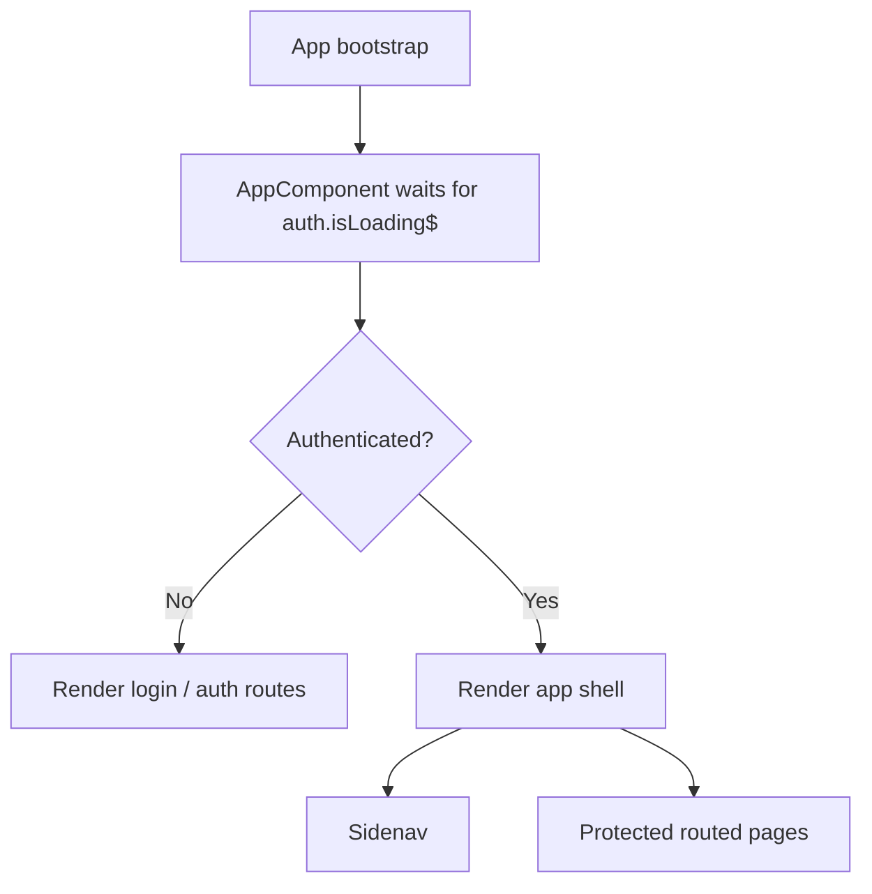
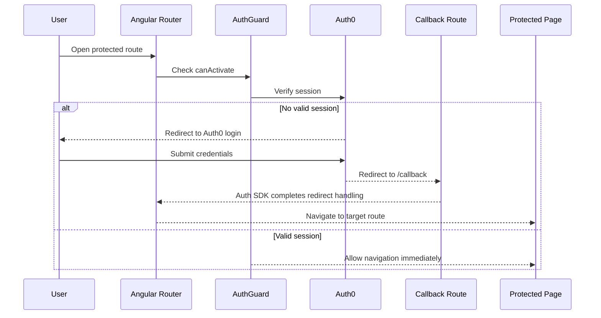
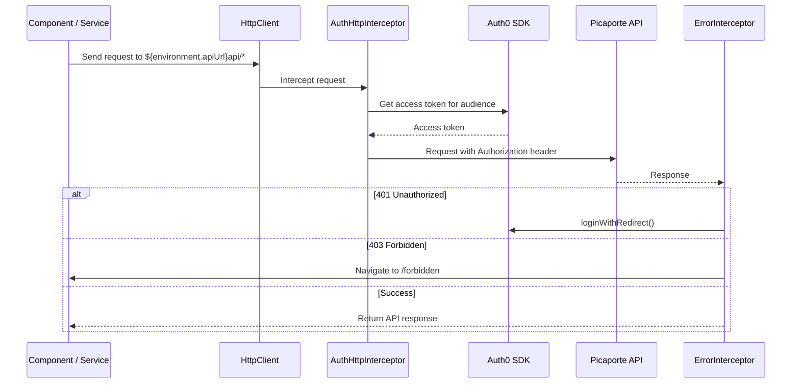

# Picaporte Backoffice Frontend

Angular backoffice application for managing Picaporte operational data such as properties, customers, users, tasks, news, static data, and related assets. The UI is protected with Auth0 and communicates with the Picaporte API through authenticated HTTP requests.

## Table of Contents

- [Overview](#overview)
- [Repository Layout](#repository-layout)
- [Main Features](#main-features)
- [Local Development](#local-development)
- [Runtime Configuration](#runtime-configuration)
- [Application Structure](#application-structure)
- [Routing Summary](#routing-summary)
- [Authentication Flow](#authentication-flow)
- [Authentication Components](#authentication-components)
- [Login and Route Access Flow](#login-and-route-access-flow)
- [API Token Flow](#api-token-flow)
- [Error Handling Behavior](#error-handling-behavior)
- [Practical Authentication Notes](#practical-authentication-notes)
- [API Integration](#api-integration)
- [Deployment Notes](#deployment-notes)
- [Maintenance Notes](#maintenance-notes)

## Overview

- Framework: Angular 13
- Authentication: Auth0 via `@auth0/auth0-angular`
- API integration: `HttpClient` services under `picaporte-frontend/src/app/api-service`
- Primary deployment target: Vercel for the frontend, remote REST API for business data
- Build output: `picaporte-frontend/dist/picaporte-frontend`

## Repository Layout

```text
.
|-- README.md
|-- vercel.json
`-- picaporte-frontend/
    |-- angular.json
    |-- package.json
    |-- src/
        |-- app/
        |   |-- api-service/            # REST API clients
        |   |-- authentication-service/ # Local auth-related helpers
        |   |-- callback/               # Auth0 redirect landing route
        |   |-- dashboard-components/   # Dashboard pages
        |   |-- interceptors/           # Auth and error handling
        |   |-- layout-components/      # Shell / sidenav
        |   |-- property-components/    # Property management UI
        |   |-- customer-components/    # Customer management UI
        |   |-- user-components/        # User management UI
        |   `-- router-components/      # Tasks, links, news, static data
        `-- environments/               # Dev and prod runtime configuration
```

## Main Features

- Authenticated dashboard and CRUD workflows for properties, customers, and users
- Task and to-do management screens
- News management and approval workflows
- Static data maintenance screens for reference data
- Document and image-related API interactions
- Shared layout with a protected sidenav-based application shell

## Local Development

### Prerequisites

- Node.js compatible with Angular 13 tooling
- npm

### Install

```bash
cd picaporte-frontend
npm install
```

### Run the app

```bash
npm start
```

The Angular dev server runs at [http://localhost:4200](http://localhost:4200) by default.

### Build

```bash
npm run build
```

### Unit tests

```bash
npm test
```

## Runtime Configuration

Environment-specific values live in:

- `picaporte-frontend/src/environments/environment.ts`
- `picaporte-frontend/src/environments/environment.prod.ts`

These files define:

- `apiUrl`: base URL for the Picaporte API
- `auth0.domain`
- `auth0.clientId`
- `auth0.audience`
- `auth0.redirectUri`
- additional frontend keys such as Mapbox and API integration settings

Production builds replace `environment.ts` with `environment.prod.ts` through `angular.json`.

## Application Structure

At a high level the app is split into three layers:

1. Routing and shell
2. Feature components
3. API services and interceptors

The root component waits for Auth0 loading to finish before rendering the application shell. Once authenticated, users see the sidenav layout and the routed feature area. When not authenticated, the router renders the login flow instead.



## Routing Summary

Public or semi-public routes:

- `/login`
- `/callback`
- `/forbidden`
- `/access-denied`

Protected routes guarded by Auth0:

- `/`
- `/Imoveis`
- `/Imovel/:id`
- `/Clientes`
- `/Cliente/:id`
- `/Utilizadores`
- `/Utilizador/:id`
- `/Tarefas`
- `/Noticias`
- `/ToDos`
- `/Links`
- `/GestaoDeDados`

The `AuthGuard` is applied directly in `picaporte-frontend/src/app/app-routing.module.ts` to all application routes that require a signed-in user.

## Authentication Flow

The frontend uses the Auth0 Angular SDK configured in `picaporte-frontend/src/app/app.module.ts`. Authentication is a combination of route guards, redirect-based sign-in, token injection for API calls, and centralized handling for authorization errors.

### Authentication components

- `AuthModule.forRoot(...)` configures Auth0 domain, client ID, audience, redirect URI, and token injection rules.
- `AuthGuard` protects the main application routes.
- `LoginComponent` triggers `loginWithRedirect(...)`.
- `CallbackComponent` receives the Auth0 redirect response at `/callback`.
- `AuthHttpInterceptor` attaches access tokens to requests that match the configured API allow list.
- `ErrorInterceptor` reacts to backend `401` and `403` responses.
- `AccessDeniedComponent` gives the user a recovery path and logout option.

### Login and route access flow



### API token flow

`AuthModule` is configured so the Auth0 HTTP interceptor only attaches tokens to requests matching:

```text
${environment.apiUrl}api/*
```

That means API calls routed through the configured backend automatically receive an access token for the configured Auth0 audience, while unrelated requests do not.



### Error handling behavior

- `401 Unauthorized`: the custom interceptor starts a new Auth0 login redirect
- `403 Forbidden`: the app navigates to `/forbidden`
- logout actions return the user to `/login` or the application origin, depending on the component that initiated logout

### Practical authentication notes

- The app uses a dedicated `/callback` route as the Auth0 redirect target.
- The root component waits for `auth.isLoading$` to finish before showing routed content, which avoids rendering protected UI while the session is still being resolved.
- The login screen also listens for `isAuthenticated$` so already-signed-in users are returned to `/`.
- Because route access and API authorization are enforced separately, a signed-in user can still land on the access-denied view if the backend rejects the token for a specific action.

## API Integration

The service layer is organized by domain under `picaporte-frontend/src/app/api-service`. Examples include:

- `queries-property`
- `queries-customer`
- `queries-user`
- `queries-task`
- `queries-export`
- `news`
- `to-do`
- `notification`
- static data services for property metadata and other reference entities

Most services build endpoint URLs from `environment.apiUrl` plus `apiEndpoints`, keeping route definitions centralized in the environment files.

## Deployment Notes

- `vercel.json` is present at the repository root for frontend deployment configuration.
- Angular production builds use the `production` configuration in `picaporte-frontend/angular.json`.
- The production environment currently points to `https://picaporte-api.onrender.com/` for API traffic.

## Maintenance Notes

- Keep Auth0 tenant details, callback URLs, and allowed origins aligned with the deployed frontend URL.
- If the backend API base path changes, update both `environment` files and confirm the Auth0 interceptor `allowedList` still matches the protected endpoints.
- If new protected routes are introduced, add `AuthGuard` coverage in the router.
- If API calls move outside `${environment.apiUrl}api/*`, expand the interceptor allow list or those calls will not receive access tokens automatically.
