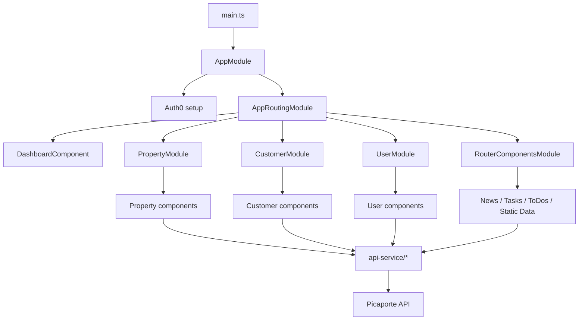
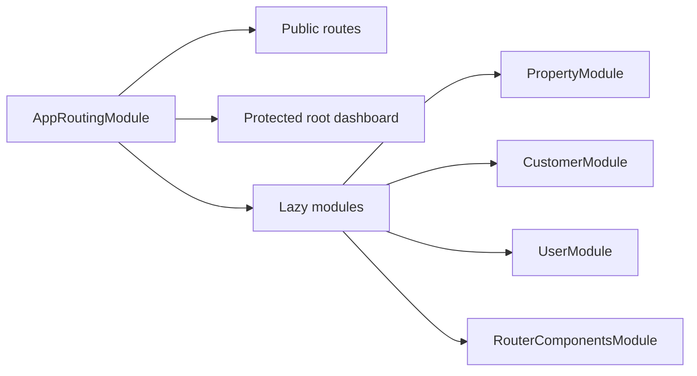
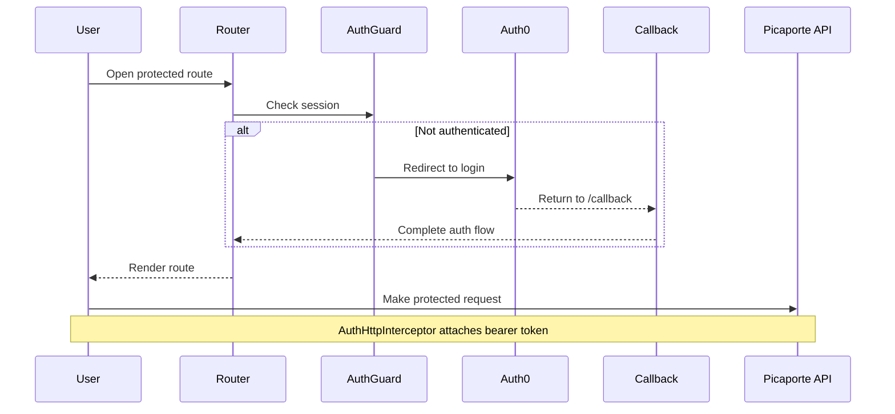
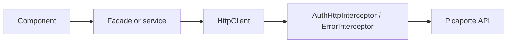

# Picaporte Backoffice Frontend

Angular 17 backoffice application for Picaporte's internal operations. The app is authenticated with Auth0, deployed to Vercel, and talks to the Picaporte backend over authenticated REST APIs for property, customer, user, task, news, and static-data workflows.

## Table of Contents

- [Overview](#overview)
- [Repository Layout](#repository-layout)
- [Technology Stack](#technology-stack)
- [Feature Areas](#feature-areas)
- [Architecture](#architecture)
- [Routing](#routing)
- [Authentication Flow](#authentication-flow)
- [Data and API Layer](#data-and-api-layer)
- [Configuration](#configuration)
- [Environment Variables](#environment-variables)
- [Local Development](#local-development)
- [Build and Deployment](#build-and-deployment)
- [Maintenance Notes](#maintenance-notes)

## Overview

- Application: internal backoffice UI for operational workflows
- Frontend framework: Angular 17
- Language: TypeScript
- Authentication: Auth0 via `@auth0/auth0-angular`
- Deployment target: Vercel
- Production API base URL: `https://picaporte-api.onrender.com/`
- Source application directory: `picaporte-frontend/`

This repository now uses a single documentation entrypoint: this root `README.md`.

## Repository Layout

```text
.
|-- README.md
|-- vercel.json
`-- picaporte-frontend/
    |-- angular.json
    |-- package.json
    |-- package-lock.json
    |-- tsconfig.json
    |-- scripts/
    |   `-- generate-environment-secrets.js
    `-- src/
        |-- app/
        |   |-- api-service/              # Backend service clients and facades
        |   |-- authentication-service/   # Shared auth header helper used by legacy service flows
        |   |-- callback/                 # Auth0 redirect landing route
        |   |-- customer-components/      # Customer pages and subviews
        |   |-- dashboard-components/     # Root and domain dashboard screens
        |   |-- features/                 # Lazy-loaded Angular feature modules
        |   |-- generic-components/       # Reusable widgets and shared UI
        |   |-- interceptors/             # Auth0 and HTTP error handling
        |   |-- layout-components/        # Navigation and app shell
        |   |-- property-components/      # Property pages and subviews
        |   |-- router-components/        # News, tasks, todos, static-data routes
        |   |-- services/                 # Shared app services
        |   |-- shared/                   # Shared Angular module
        |   |-- structures/               # View-specific structures and DTO helpers
        |   `-- user-components/          # User pages and subviews
        `-- environments/                 # Environment config and API endpoint map
```

## Technology Stack

- Angular 17
- TypeScript 5.4
- RxJS 7
- Angular CDK
- Bootstrap 5
- CKEditor 5
- Font Awesome
- Auth0 Angular SDK

## Feature Areas

- Properties: dashboards, create/edit flows, characteristics, documents, images, online status, renting, recommendations, and property-linked tasks
- Customers: dashboard, create/edit flows, detail views, and linked properties
- Users: dashboard, create/edit flows, and detail views
- Tasks and To-Dos: operational task queues and checklist-style workflows
- News: editorial workflow with CKEditor-based rich text editing
- Static Data: maintenance screens for reference entities used throughout the app

## Architecture

The app is organized around a small root shell and several lazy-loaded feature modules. Shared services and domain API services sit beneath the UI layer.



Key traits:

- Route-level separation using lazy-loaded Angular modules
- Shared shell components declared in the root app module
- Domain-oriented service layer under `src/app/api-service`
- Auth0 token injection through Angular HTTP interceptors
- Environment-driven API and Auth0 configuration

## Routing

The app root routes are declared in [app-routing.module.ts](/D:/Repos/picaporte-backoffice-frontend/picaporte-frontend/src/app/app-routing.module.ts). Feature routes are defined inside each feature module.

Public routes:

- `/login`
- `/callback`
- `/forbidden`
- `/access-denied`

Protected routes:

- `/`
- `/Imoveis`
- `/Imovel`
- `/Imovel/:id`
- `/Clientes`
- `/Cliente`
- `/Cliente/:id`
- `/Utilizadores`
- `/Utilizador`
- `/Utilizador/:id`
- `/Noticias`
- `/ToDos`
- `/Tarefas`
- `/GestaoDeDados`

Feature ownership:

- `PropertyModule`: `/Imoveis`, `/Imovel`, `/Imovel/:id`
- `CustomerModule`: `/Clientes`, `/Cliente`, `/Cliente/:id`
- `UserModule`: `/Utilizadores`, `/Utilizador`, `/Utilizador/:id`
- `RouterComponentsModule`: `/Noticias`, `/ToDos`, `/Tarefas`, `/GestaoDeDados`



## Authentication Flow

Auth0 is configured in [app.module.ts](/D:/Repos/picaporte-backoffice-frontend/picaporte-frontend/src/app/app.module.ts).

- `AuthGuard` protects the dashboard and every lazy-loaded feature module
- `AuthHttpInterceptor` attaches bearer tokens to `${environment.apiUrl}api/*`
- `ErrorInterceptor` redirects `401` responses into the login flow and sends `403` responses to `/forbidden`
- `CallbackComponent` handles the Auth0 redirect callback



## Data and API Layer

The backend integration lives under `picaporte-frontend/src/app/api-service`. The app uses environment config for the API base URL and a large endpoint map exported from the environment files.

Main endpoint groups:

- `queries_entityReference`
- `queries_customer`
- `queries_user`
- `queries_export`
- `queries_task`
- `queries_property`
- `customer`
- `renting`
- `news`
- `toDos`
- `image`
- `document`
- `activityLog`
- `notification`
- `static_*` reference-data groups

Data flow at a high level:



## Configuration

Primary config files:

- [vercel.json](/D:/Repos/picaporte-backoffice-frontend/vercel.json)
- [angular.json](/D:/Repos/picaporte-backoffice-frontend/picaporte-frontend/angular.json)
- [package.json](/D:/Repos/picaporte-backoffice-frontend/picaporte-frontend/package.json)
- [environment.ts](/D:/Repos/picaporte-backoffice-frontend/picaporte-frontend/src/environments/environment.ts)
- [environment.prod.ts](/D:/Repos/picaporte-backoffice-frontend/picaporte-frontend/src/environments/environment.prod.ts)
- [generate-environment-secrets.js](/D:/Repos/picaporte-backoffice-frontend/picaporte-frontend/scripts/generate-environment-secrets.js)

Current environment defaults:

- Development API base URL: `https://localhost:32769/`
- Production API base URL: `https://picaporte-api.onrender.com/`
- Production Angular build is the default build configuration
- Vercel output directory: `picaporte-frontend/dist/picaporte-frontend`

The build expects `src/environments/environment.secrets.ts`. If that file is missing, the prebuild scripts generate it from environment variables.

## Environment Variables

The environment generator supports these variables:

- `NG_APP_API_KEY`
- `NG_APP_MAPBOX_ACCESS_TOKEN`
- `NG_APP_AUTH0_DOMAIN`
- `NG_APP_AUTH0_CLIENT_ID`
- `NG_APP_AUTH0_AUDIENCE`
- `NG_APP_AUTH0_REDIRECT_URI`

Notes:

- `NG_APP_AUTH0_REDIRECT_URI` is optional
- If `NG_APP_AUTH0_REDIRECT_URI` is not set, the generated config uses `window.location.origin + '/callback'`
- The generator runs before `npm start`, `npm run build`, and `npm run watch`
- Values used by the frontend are public at runtime and should be treated as client-side configuration, not backend-only secrets

## Local Development

Prerequisites:

- Node.js compatible with Angular 17
- npm

Install:

```bash
cd picaporte-frontend
npm install
```

Start the dev server:

```bash
npm start
```

Build for production:

```bash
npm run build
```

Watch mode:

```bash
npm run watch
```

Notes:

- The default Angular dev server runs at `http://localhost:4200`
- The repository does not currently define a `test` script

## Build and Deployment

Vercel uses the repository-level [vercel.json](/D:/Repos/picaporte-backoffice-frontend/vercel.json):

- Build command: `cd picaporte-frontend && npm install && npm run build`
- Output directory: `picaporte-frontend/dist/picaporte-frontend`

Deployment checklist:

1. Add the required `NG_APP_*` variables to the Vercel project.
2. Ensure Auth0 allowed callback URLs and web origins include the deployed frontend URL.
3. Ensure the backend allows requests from the deployed frontend origin.
4. Trigger a production deploy.

## Maintenance Notes

- Keep Auth0 callback URLs, logout URLs, and allowed origins aligned with every active frontend environment
- When backend routes change, update both the base URL and the endpoint map in the environment files
- If protected endpoints move outside `${environment.apiUrl}api/*`, update the Auth0 interceptor allowed list
- Prefer updating this root README instead of adding new per-folder README files unless there is a strong reason for local documentation
