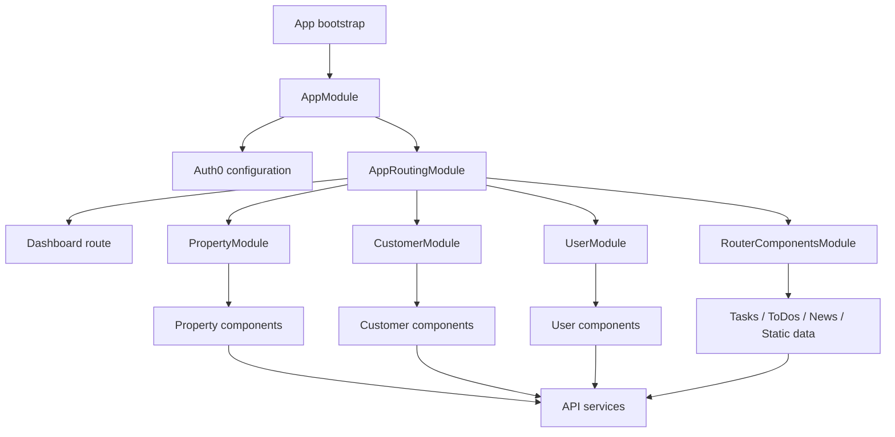
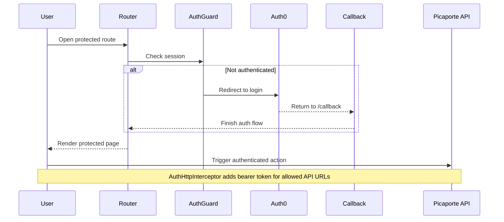

# Picaporte Backoffice Frontend

Backoffice frontend for Picaporte's internal operations. This repository contains the Angular application used to manage properties, customers, users, tasks, news, static reference data, and related media/documents through authenticated API calls.

## Table of Contents

- [Overview](#overview)
- [Tech Stack](#tech-stack)
- [Repository Layout](#repository-layout)
- [Feature Areas](#feature-areas)
- [Architecture](#architecture)
- [Authentication and Authorization](#authentication-and-authorization)
- [Routing](#routing)
- [API Integration](#api-integration)
- [Configuration](#configuration)
- [Local Development](#local-development)
- [Build and Deployment](#build-and-deployment)
- [Maintenance Notes](#maintenance-notes)

## Overview

- Frontend framework: Angular 17
- Auth provider: Auth0 via `@auth0/auth0-angular`
- UI scope: operational backoffice for property, customer, user, news, task, and static data management
- API style: authenticated REST calls against the Picaporte backend
- Deployment target: Vercel for the frontend
- App source: `picaporte-frontend/`

## Tech Stack

- Angular 17
- TypeScript 5.4
- RxJS 7
- Angular CDK
- CKEditor 5
- Bootstrap 5
- Auth0 Angular SDK

## Repository Layout

```text
.
|-- README.md
|-- VULNERABILITIES.md
|-- vercel.json
`-- picaporte-frontend/
    |-- angular.json
    |-- package.json
    |-- src/
        |-- app/
        |   |-- api-service/              # Domain API clients and facades
        |   |-- authentication-service/   # Shared request header helper
        |   |-- callback/                 # Auth0 redirect handling
        |   |-- customer-components/      # Customer forms and related views
        |   |-- dashboard-components/     # Main dashboards and KPI views
        |   |-- features/                 # Lazy-loaded feature modules
        |   |-- generic-components/       # Reusable UI building blocks
        |   |-- interceptors/             # Auth and error interceptors
        |   |-- layout-components/        # Sidenav and app shell
        |   |-- property-components/      # Property workflows
        |   |-- router-components/        # Tasks, news, todos, static data
        |   |-- services/                 # Shared app services
        |   |-- shared/                   # Shared Angular module
        |   |-- structures/               # View-model and dashboard structures
        |   `-- user-components/          # User management views
        `-- environments/                 # Runtime config and API endpoint maps
```

## Feature Areas

The application is organized around a few main operational domains:

- Properties: dashboards, creation/editing, characteristics, documents, images, online status, renting, recommended properties, and related tasks
- Customers: dashboards, creation/editing, details, and property relationships
- Users: dashboards, creation/editing, and detail views
- Tasks and To-Dos: routed operational work queues and item management
- News: authoring and approval flow with CKEditor
- Static Data: maintenance screens for property metadata and other reference entities
- Shared Utilities: activity logs, preferences, maps, KPI widgets, messaging, date formatting, and lightbox behavior

## Architecture

At a high level, the app is split into a root shell, lazy-loaded feature modules, and a service layer that talks to the backend.



Key architectural traits:

- Route-level feature separation through lazy-loaded Angular modules
- Shared shell and navigation components at the application root
- Domain-oriented API services under `src/app/api-service`
- Centralized request token injection and HTTP error handling with interceptors
- Environment-driven configuration for API URL, Auth0, and external integrations

## Authentication and Authorization

Auth is configured in `picaporte-frontend/src/app/app.module.ts` using Auth0's Angular SDK.

- `AuthGuard` protects the main dashboard and all lazy-loaded feature modules
- `AuthHttpInterceptor` attaches bearer tokens to requests matching `${environment.apiUrl}api/*`
- `ErrorInterceptor` redirects `401` responses back into login flow and sends `403` responses to `/forbidden`
- `CallbackComponent` handles the Auth0 redirect route
- `LoginComponent` starts the redirect-based sign-in flow



## Routing

The root routes are defined in `picaporte-frontend/src/app/app-routing.module.ts`, with feature routes split across lazy-loaded modules.

Public routes:

- `/login`
- `/callback`
- `/forbidden`
- `/access-denied`

Protected routes:

- `/`
- `/Imoveis`
- `/Imovel`
- `/Imovel/:id`
- `/Clientes`
- `/Cliente`
- `/Cliente/:id`
- `/Utilizadores`
- `/Utilizador`
- `/Utilizador/:id`
- `/Noticias`
- `/ToDos`
- `/Tarefas`
- `/GestaoDeDados`

Feature route ownership:

- `PropertyModule`: property dashboard and property detail/edit flows
- `CustomerModule`: customer dashboard and customer detail/edit flows
- `UserModule`: user dashboard and user detail/edit flows
- `RouterComponentsModule`: news, to-dos, tasks, and static data

## API Integration

The API layer lives in `picaporte-frontend/src/app/api-service` and is grouped by domain. The environment files expose both the `apiUrl` and the endpoint map used by services.

Main endpoint groups include:

- `queries_property`
- `queries_customer`
- `queries_user`
- `queries_task`
- `queries_export`
- `queries_entityReference`
- `news`
- `toDos`
- `renting`
- `image`
- `document`
- `activityLog`
- `notification`
- static data services for property and document metadata

In development, the API base URL is currently `https://localhost:32769/`. In production, it is `https://picaporte-api.onrender.com/`.

## Configuration

Runtime configuration lives in:

- `picaporte-frontend/src/environments/environment.ts`
- `picaporte-frontend/src/environments/environment.prod.ts`

Important notes:

- Secrets are intentionally not committed
- `environment.secrets.ts` is expected locally and is gitignored
- Source comments reference an `environment.secrets.example.ts` workflow, but that example file is not currently present in the repository
- Auth0 settings, API keys, and similar sensitive values are merged into the exported `environment` object through `...secrets`

Typical config values include:

- `auth0.domain`
- `auth0.clientId`
- `auth0.audience`
- `auth0.redirectUri`
- any additional frontend integration keys required by the app

## Local Development

### Prerequisites

- Node.js compatible with Angular 17 tooling
- npm

### Install dependencies

```bash
cd picaporte-frontend
npm install
```

### Start the development server

```bash
npm start
```

The Angular development server runs on [http://localhost:4200](http://localhost:4200) by default.

### Create a production build

```bash
npm run build
```

### Watch builds during development

```bash
npm run watch
```

### Testing note

The current `package.json` does not define a `test` script. If automated tests are added later, this section should be updated with the project's actual test command.

## Build and Deployment

- Angular build configuration is defined in `picaporte-frontend/angular.json`
- Production builds replace `environment.ts` with `environment.prod.ts`
- The build output directory is `picaporte-frontend/dist/picaporte-frontend`
- `vercel.json` at the repository root contains frontend deployment configuration
- The Angular `build` target defaults to the `production` configuration

## Maintenance Notes

- Keep Auth0 allowed callback URLs, logout URLs, and origins aligned with the active frontend environments
- When API routes change, update both the base URL and the endpoint map in the environment files
- If protected backend endpoints move outside `${environment.apiUrl}api/*`, update the Auth0 interceptor allow list
- When new routed sections are added, keep route protection consistent with the existing `AuthGuard` usage
- There is a stale generated README inside `picaporte-frontend/README.md`; if that file becomes user-facing, it should be updated to match the current Angular 17 setup
